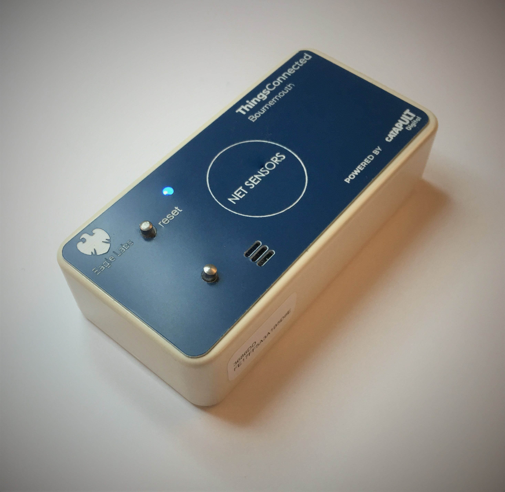
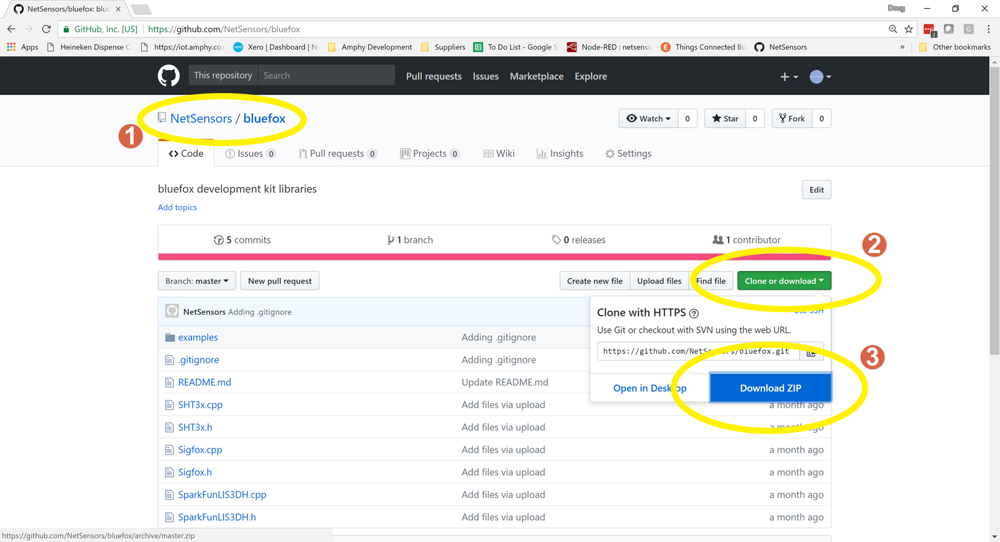
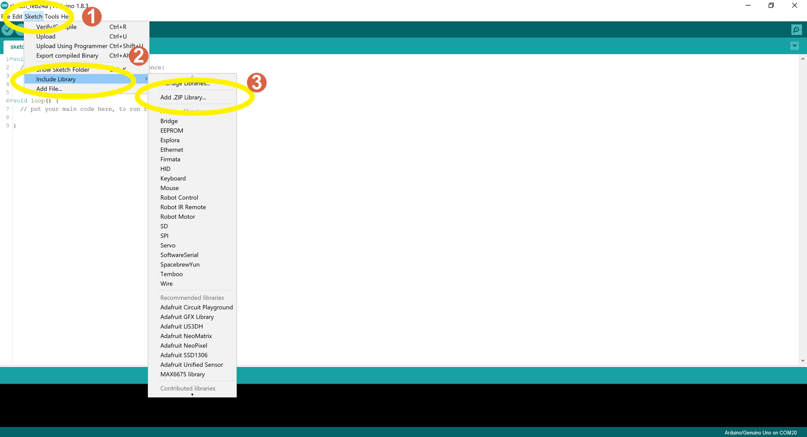
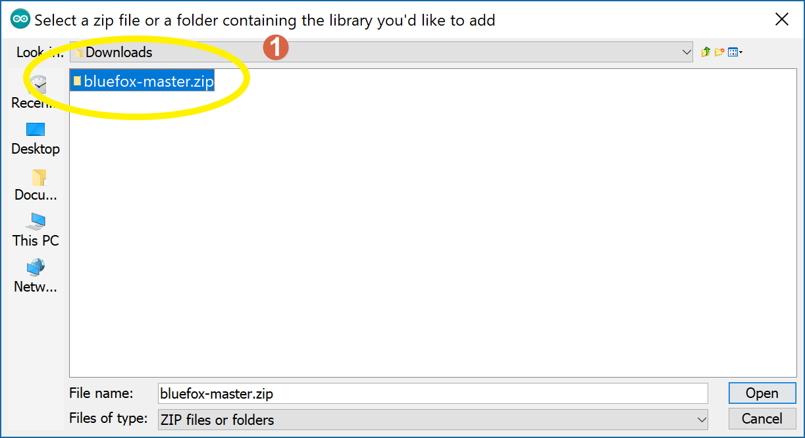
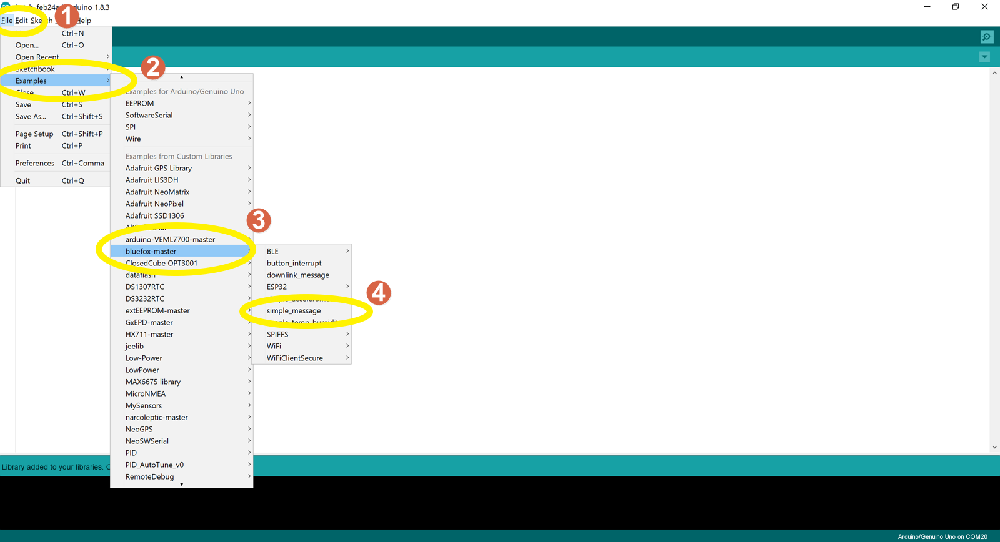
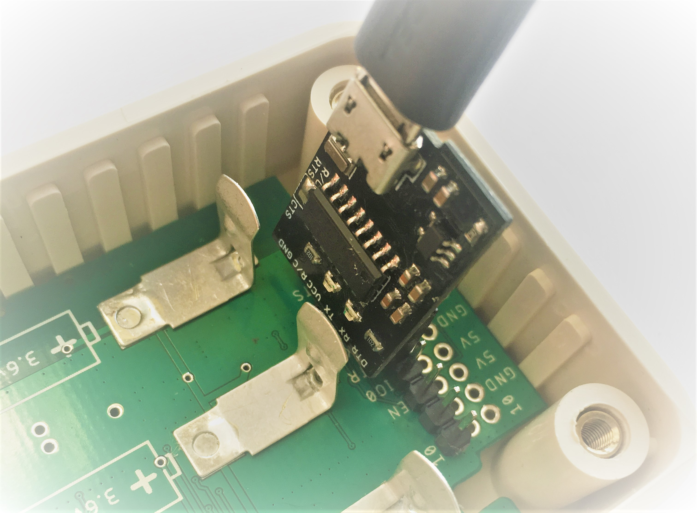
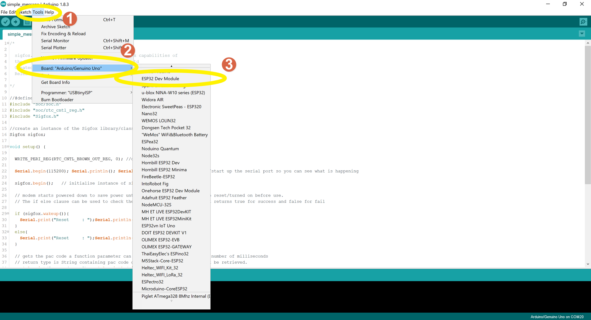
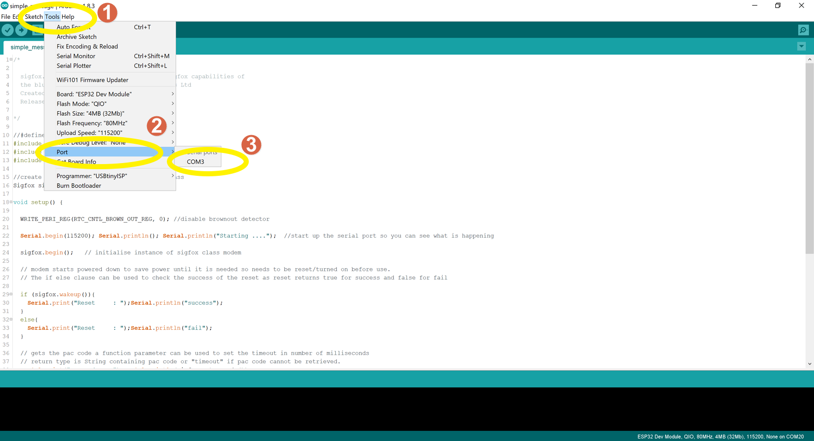
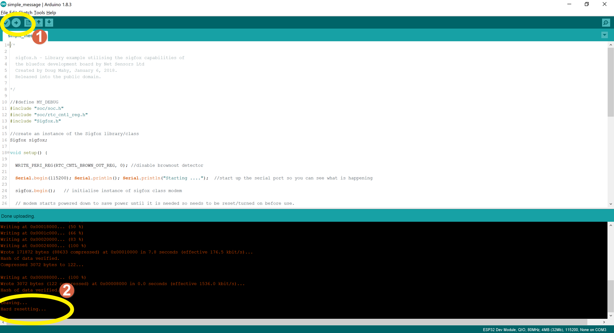
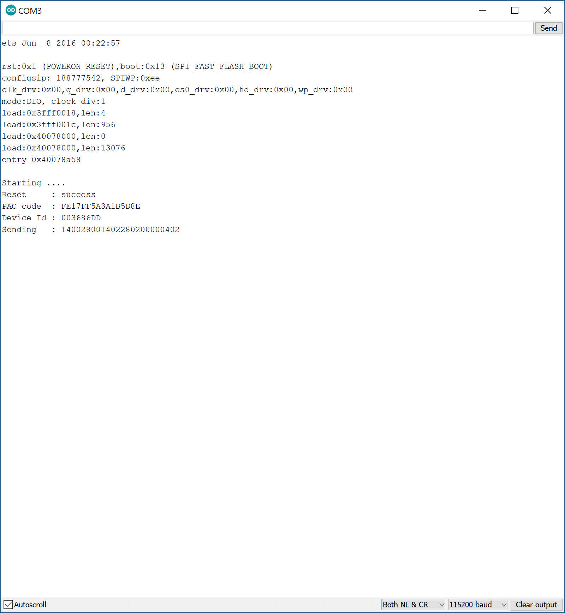

# Bluefox library for use with Development kit v2.7

Below are the instructions on how to get your buefox development kit up and running with the provided examples in the bluefox arduino library. It covers four main steps.

- Installation of the Arduino IDE
- Installation of the ESP32 board support packages
- Installation of the bluefox library and examples
- Loading and running the simple message sketch

Any problems you may experience with these instructions please raise an issue using the issues tab above.

- Install Arduino ESP32 support on Windows, instructions here https://github.com/espressif/arduino-esp32/blob/master/docs/arduino-ide/windows.md

Next we Install the bluefox libraries, setup the development enviornment and load our first sketch.

1. Navigate to https://github.com/NetSensors/bluefox 
2. Click on the green clone or download button.
3. Click on the blue download ZIP bitton and choose a location to save the zip file in. We will need this file in the next step.

1. Open the arduino IDE application, if you have not installed this yet install it now using instructions here https://github.com/espressif/arduino-esp32/blob/master/docs/arduino-ide/windows.md

Click on Sketch -> Include Library -> Add ZIP library 

1. Browse to and select the zip file we downloaded in the previous step.

Click on Edit -> Examples -> Bluefox -> simple_message this opens an example sketch.

We now need to connect our development kit to the computer so we can download the sketch (firmware) to the development kit. The image below shows how this should be done. Ensure you get the USB to serial adapter the correct way round.

1. Select Tools -> Board -> ESP32 Dev Module this selects the correct board for the Bluefox develpopment kit.

1. Select Tools -> Port -> COMXX the port number will the com port your USB atapter is connected to. 

1. Press this arrow ICON to build and compile the simple message sketch.  
2. Once complete you should see the last message in the window at the bottom being Hard Reseting... , There should be no error messages shown.

1. Select Tools -> Serial Monitor or press Ctrl+Shift+M together to bring up the serial monitor. This allows you to see the sketch output.

Below is an example of what you would expect to see from a successful installation.

